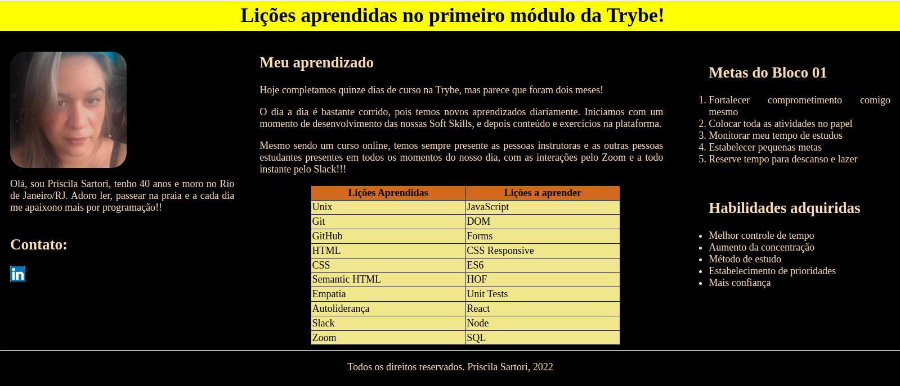

# Boas-vindas ao repositório do projeto de Lições Aprendidas!

Projeto de avaliação feito durante o curso da Trybe.

  

<strong>🧑‍💻 O que deverá ser desenvolvido</strong>
 

Você vai desenvolver um site que contenha uma série de informações sobre o que você aprendeu aqui na Trybe ao longo dos últimos três blocos. O seu site deverá estar com elementos posicionados e estilizados e, além disso, deverá conter semântica apropriada para que seja acessível e melhor ranqueado.

  
# Orientações
  

  
<strong>Para acessar o projeto</strong>
 

  1. Clone o repositório

  - Use o comando: `git clone git@github.com:priscilaSartori/project-lessons-learned.git`.
  - Entre na pasta do repositório que você acabou de clonar:
    - `cd project-tryunfo`

  2. Inicie a aplicação com a extensão Live Server no VSCode

  
# Requisitos do projeto

## 1. Adicione uma cor de fundo para a página

## 2. Adicione uma barra superior com um título
- A barra deve possuir o ID `cabecalho`;
- A barra superior deve ser fixa no topo da página;
- A barra deve ter a propriedade `top` tendo o valor `0`;
- O título deve estar dentro da barra e possuir o ID `titulo`, além de ser uma tag `h1`.

## 3. Adicione uma foto sua à página
- A foto deve ser uma tag `img` e possuir o ID `minha_foto`.

## 4. Adicione uma lista à página numerada
- A lista deve ser numerada;
- A lista deve possuir 10 itens.

## 5. Crie uma lista de lições não numerada para a página
- A lista não deve ser numerada;
- A lista deve possuir 10 itens.

## 6. Adicione um rodapé para a página
- O rodapé deve possuir a tag `footer`;
- O rodapé deve possuir o ID `rodape`.

## 7. Insira pelo menos um link externo na página
- O link deve ser aberto em nova aba no navegador.

## 8. Crie um artigo sobre o seu aprendizado
- O artigo deve possuir a tag `article`;
- O artigo deve ter mais de 300 caracteres e menos de 600.

## 9. Crie uma tag html `aside` que contenha uma breve descrição sobre você
- A tag `aside` deve ser utilizada;
- A sua descrição deve ter mais que 100 caracteres e menos que 300.

## 10. Aplique elementos HTML de acordo com o sentido e propósito de cada um deles
- A página deve possuir um elemento `article`;
- A página deve possuir um elemento `header`;
- A página deve possuir um elemento `aside`;
- A página deve possuir um elemento `footer`.

## 11. Teste a semântica da sua página usando o site [CodeSniffer](https://squizlabs.github.io/HTML_CodeSniffer/)
- A sua página deve passar com `0 errors` na verificação de semântica do site [CodeSniffer](https://squizlabs.github.io/HTML_CodeSniffer/).
 
# Requisitos Bônus
## 12. Adicione uma tabela à página
- A página deve possuir um elemento `<table>`.

## 13. Utilize o Box model
- Algum elemento deve ter o atributo `margin` modificado;
- Algum elemento deve ter o atributo `padding` modificado;
- Algum elemento deve ter o atributo `border` modificado.

## 14. Altere atributos relacionados às fontes
- O estilo da tipografia deve ter o tamanho da letra alterado;
- O estilo da tipografia deve ter a cor da letra alterada;
- O estilo da tipografia deve ter o espaçamento entre as linhas alterado;
- O estilo da tipografia deve ter o atributo `font-family`.

## 15. Posicione a tag `article` e a tag `aside` uma ao lado do outra
- O elemento posicionado à esquerda deve utilizar a classe `lado-esquerdo`;
- O elemento posicionado à direita deve utilizar a classe `lado-direito`;
- Os elementos com as classes `lado-direito` e `lado-esquerdo` estão posicionados corretamente.

